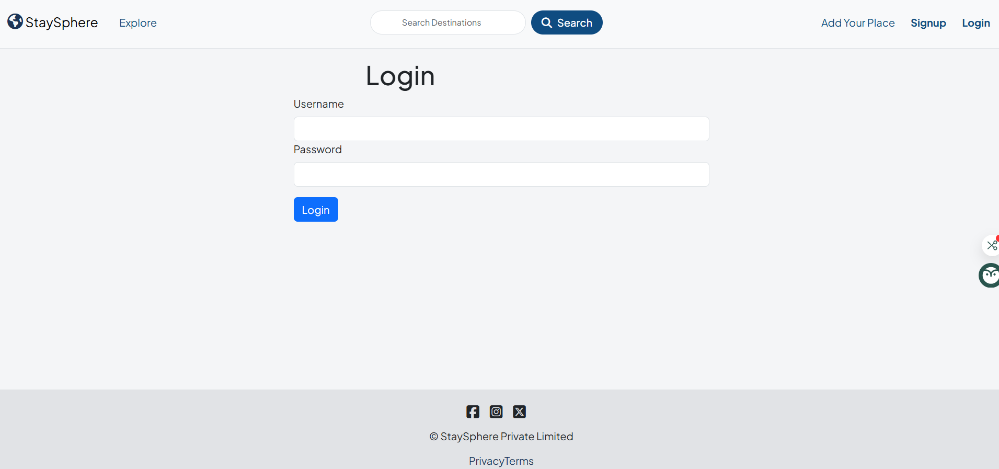
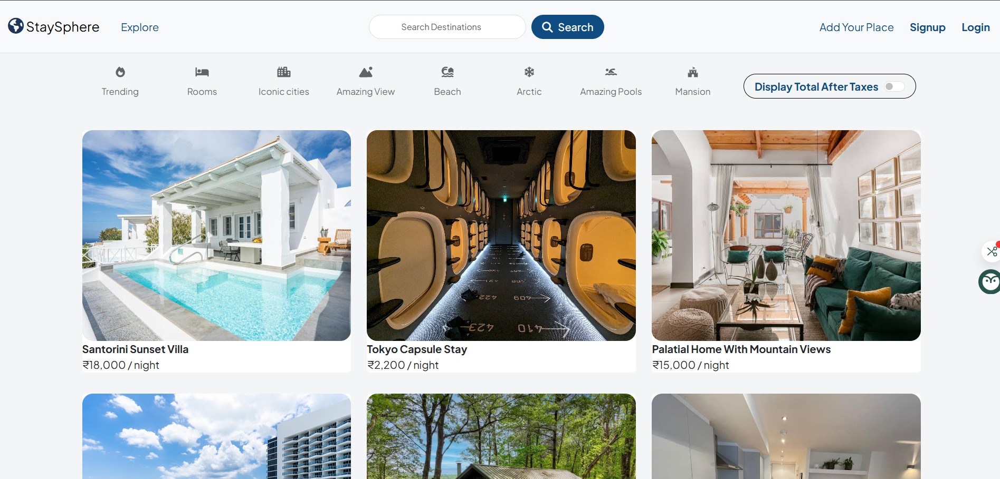
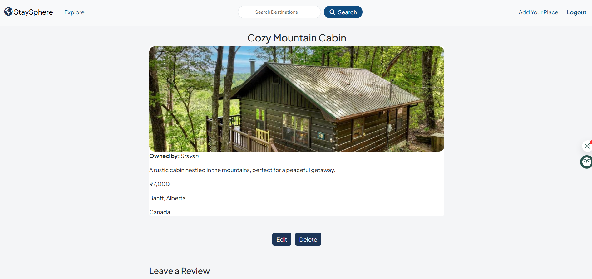
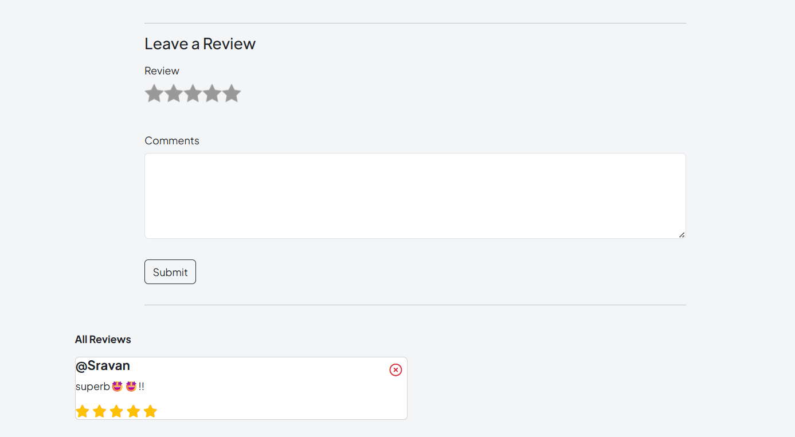
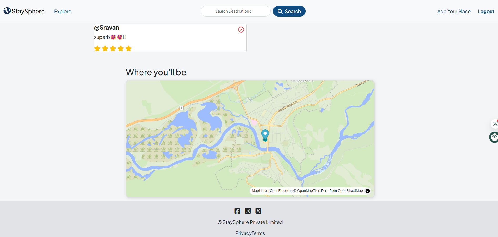
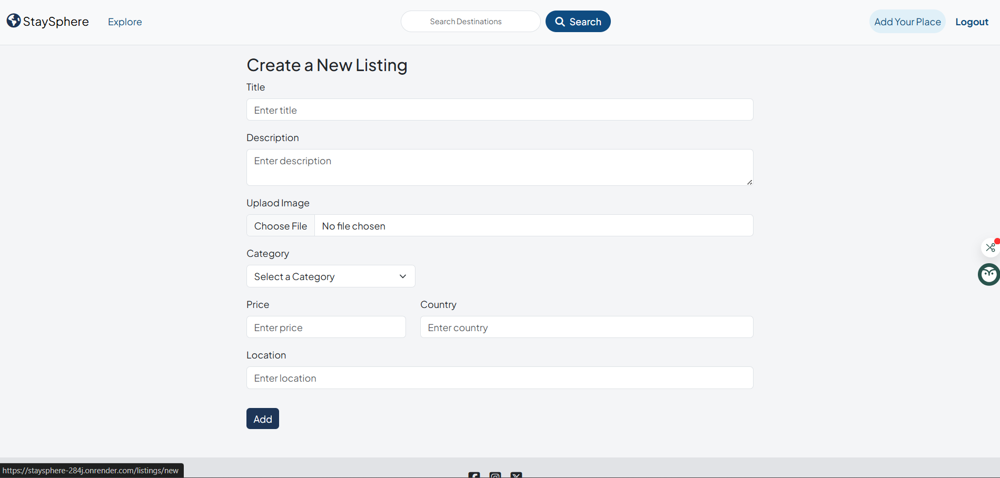

# StaySphere – Full-Stack Airbnb Clone

🌐 **Live Demo:** [https://staysphere-284j.onrender.com](https://staysphere-284j.onrender.com)

StaySphere is a full-featured vacation rental web application inspired by Airbnb. It allows users to list, browse, and manage properties for short-term stays. Built with a focus on maintainability and scalability, the app follows the **Model-View-Controller (MVC)** architectural pattern using **Node.js**, **Express**, **MongoDB**, and **EJS** for server-side rendering.

From listing creation to user authentication, StaySphere replicates the core functionality of Airbnb while maintaining a clean backend structure and a responsive, user-friendly interface.

---

## 🛠️ Tech Stack

- **Backend:** Node.js, Express.js, MongoDB (Mongoose)
- **Templating Engine:** EJS
- **Authentication:** Passport.js
- **Image Uploads:** Multer + Cloudinary
- **Styling:** Bootstrap / Custom CSS

---

## 🚀 Core Features

- 🔧 Full **CRUD operations** for listings and reviews  
- 🔐 **User authentication** and **role-based authorization**  
- 🏷️ **Category-based filtering** (e.g., Beach, Amazing Views, Iconic Cities)  
- 🖼️ **Image uploads** and listing galleries via Cloudinary  
- ✅ **Server-side validation** with Joi and error handling middleware  
- 📱 **Mobile-responsive design** with EJS and Bootstrap

---

## 📸 Screenshots

### 🔐 Login Page


### 🏡 Listing Show Page


### 🔎 Detailted Page


### ✍️ Leave a Review


### 🌍 Location Map View


### ➕ Create a New Listing


---

## 🚀 Getting Started

1️⃣ Clone the repository:
```bash
git clone https://github.com/yourusername/staysphere.git
cd staysphere

2️⃣ Install dependencies
```bash
npm install

3️⃣ Create a .env file with your environment variables
```bash
DATABASE_URL=
CLOUDINARY_CLOUD_NAME=
CLOUDINARY_KEY=
CLOUDINARY_SECRET=
SECRET=

4️⃣ Run the app locally
```bash
npm start


